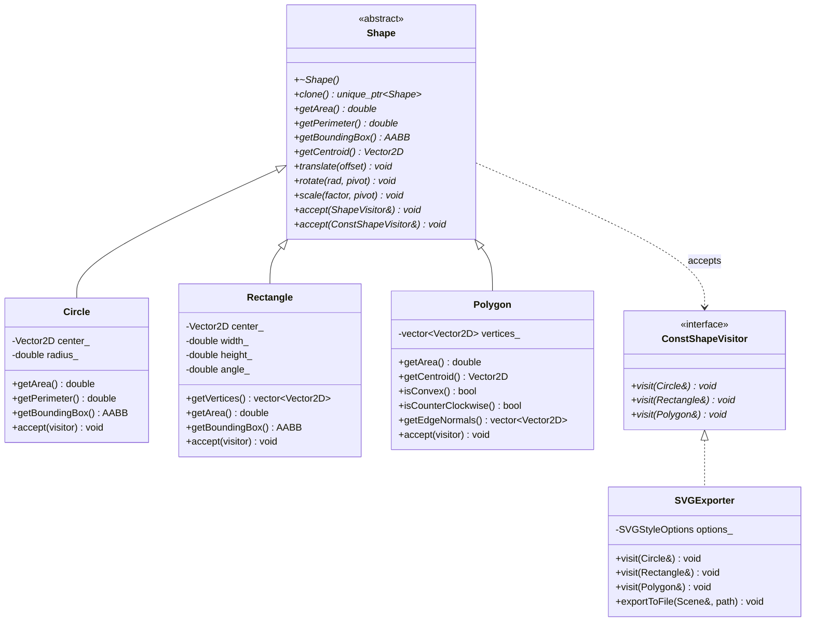
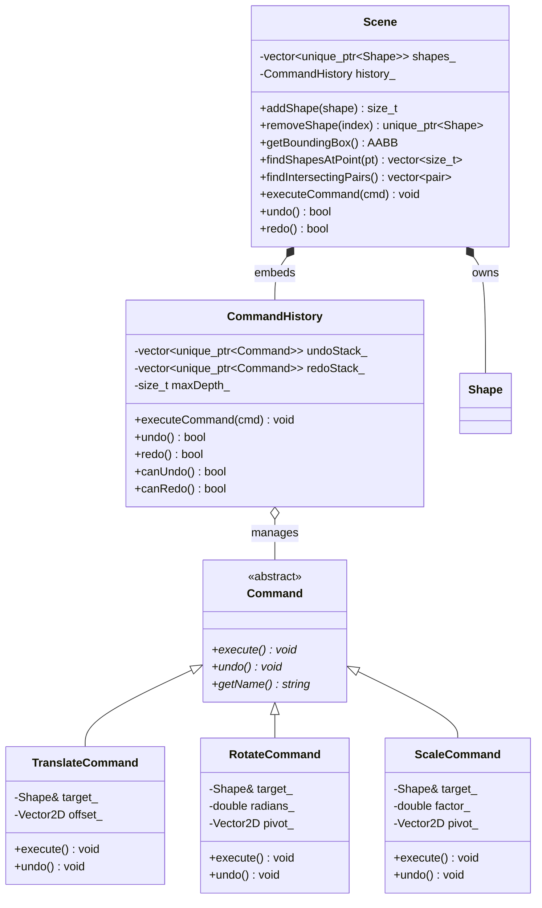
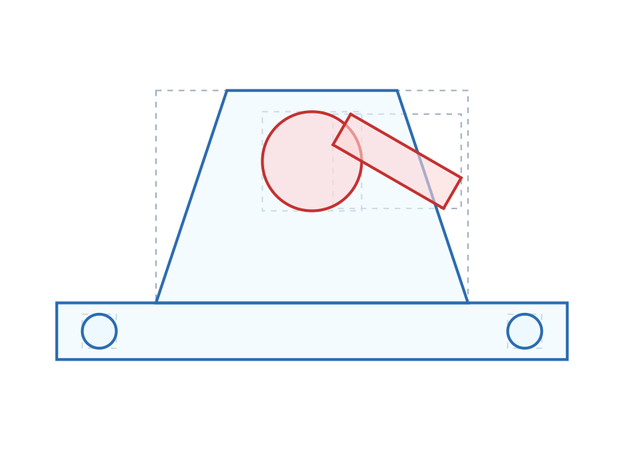

# MiniCAD: 2D Geometry & Shape-Modeling Engine

[](https://en.wikipedia.org/wiki/C%2B%2B17)
[](https://cmake.org)
[](https://github.com/catchorg/Catch2)
[](LICENSE)

MiniCAD is a high-performance, modular 2D CAD geometry and shape-modeling engine implemented in idiomatic **modern C++ (C++17)**. It was engineered from the ground up as an engineering portfolio project demonstrating clean software architecture, object-oriented design patterns, computational geometry algorithms, and numerical robustness suitable for CAD/PLM software engineering roles.

---

## Key Highlights

- **Modern C++ Idioms**: Strict RAII, smart pointer ownership semantics (`std::unique_ptr`), zero raw `new`/`delete`, explicit deletion of slicing operations, and `const`/`noexcept` correctness throughout.
- **Polymorphic Geometry Hierarchy**: Pure abstract `Shape` base class with concrete `Circle`, oriented `Rectangle`, and arbitrary `Polygon` primitives, backed by a 16-byte value-semantic `Vector2D` vector algebra engine.
- **Production-Grade Geometric Algorithms**:
  - **Broadphase Acceleration**: $O(1)$ Axis-Aligned Bounding Box (AABB) interval overlap rejection.
  - **Narrowphase Collision**: Separating Axis Theorem (**SAT**) for convex polygons and rectangles; clamped line-segment projections for circle-polygon/rectangle boundaries.
  - **Point-in-Shape Containment**: Ray-Casting algorithm (**Jordan Curve Theorem / Even-Odd rule**) handling general simple polygons (convex and concave) with floating-point boundary tolerance.
  - **Gauss's Shoelace Theorem & Exact Centroid**: Computes exact planar area and center of mass using 2D perp-dot cross products.
- **Design Patterns Used Purposefully**:
  - **Visitor Pattern**: Double-dispatch for serialization, spatial queries, and type-safe pairwise intersection testing without `dynamic_cast` cascades or runtime type pollution.
  - **Command Pattern & CommandHistory**: Fully reversible, symmetrical undo/redo architecture with redo stack pruning on new actions and configurable history bounds.
  - **Prototype Pattern**: Virtual `clone()` mechanism enabling deep copies of polymorphic shapes behind abstract pointers.
- **Visual Verification**: SVG exporter generating clean, standards-compliant vector graphics with collision highlighting and broadphase AABB bounding boxes.
- **Exhaustive Unit Testing**: 265 Catch2 assertions across 3 dedicated test suites verifying mathematical edge cases, degenerate inputs, transformations, and collision matrices.

---

## Architectural Diagrams

### 1. Shape Hierarchy & Visitor Pattern


### 2. Command Pattern & Undo/Redo Engine


---

## Design Decisions & Architectural Rationale

### 1. `std::unique_ptr<Shape>` vs Value Semantics vs `std::shared_ptr`
- **Why not value semantics in containers?** In C++, holding base classes by value in standard containers (`std::vector<Shape>`) causes **object slicing**: derived fields are truncated, and derived vtables are reset to the base class.
- **Why `std::unique_ptr` instead of `std::shared_ptr`?** In CAD document models, shapes have a single, unambiguous owner: the `Scene`. Using `std::unique_ptr` establishes strict exclusive ownership. It incurs zero reference-counting atomic synchronization overhead, eliminates circular memory leaks, and enables explicit move semantics. Callers borrow shapes via non-owning raw pointers (`Shape*` / `const Shape*`), honoring the C++ Core Guidelines (*use smart pointers for ownership, raw pointers/references for borrowing*).

### 2. Slicing Prevention & The Prototype Pattern
- `Shape` explicitly marks `Shape(const Shape&) = delete;` and `Shape& operator=(const Shape&) = delete;`. This guarantees that accidental value copying is caught at compile time.
- To create deep copies of polymorphic shapes when only an abstract `Shape*` is known, MiniCAD implements the **Prototype pattern** via `virtual std::unique_ptr<Shape> clone() const = 0;`. Derived classes invoke the base constructor explicitly (`Circle(const Circle& o) : Shape(), ...`), preserving base-level slicing protection while allowing safe polymorphic duplication.

### 3. The Visitor Pattern: Double Dispatch vs `dynamic_cast`
In CAD engines, operations over shapes (e.g. rendering, DXF/SVG export, mass properties, meshing) evolve independently of the shape hierarchy:
- **Avoiding Virtual Method Bloat**: Adding `exportToSVG()` directly to `Shape` violates the **Single Responsibility Principle** and **Open/Closed Principle**. Every new file format would force recompilation of the entire geometry kernel.
- **Eliminating `dynamic_cast` Cascades**: Without Visitor, routines inspecting heterogeneous shapes rely on `if (auto c = dynamic_cast<Circle*>(shape))` ladders. This is an $O(N)$ runtime check that is brittle and easily broken when new shapes are introduced.
- **Symmetric Double Dispatch**: In MiniCAD, both SVG export and shape-shape collision detection utilize double dispatch. In collision checking, `a.accept(PrimaryVisitor(b))` dispatches on $A$, which in turn calls `b.accept(SecondaryVisitor(ConcreteA))`. The exact primitive collision routine resolves in $O(1)$ at compile time via standard vtables with zero RTTI.

### 4. Separating Axis Theorem (SAT) for Convex Polygons
- Derived from the Hyperplane Separation Theorem: two convex shapes do not intersect if and only if there exists a line (axis) onto which their 1D projections are disjoint.
- MiniCAD computes edge normals using the perpendicular operator $\mathbf{v}^\perp = (-y, x)$ from `Vector2D`, normalizes them, and projects vertices via the dot product.
- **Complexity**: $O(V_1 + V_2)$ where $V_1, V_2$ are vertex counts. For oriented rectangles, only 2 unique orthogonal axes per rectangle need evaluation.

### 5. Ray-Casting Point Containment (Jordan Curve Theorem)
- Casts a horizontal ray from point $P$ to $(+\infty, P_y)$ and counts intersections with polygon edges.
- Works for arbitrary planar simple polygons (both convex and concave).
- Floating-point singularities (e.g. rays passing exactly through vertices or collinear horizontal segments) are handled by evaluating boundary distance first and applying strict half-open inequality conditions on $Y$ coordinates.

---

## Algorithmic Complexity

| Component | Operation | Time Complexity | Space Complexity | Notes / Guarantees |
|---|---|---|---|---|
| **Vector2D** | Arithmetic (`+`, `-`, `*`, `/`) | $O(1)$ | $O(1)$ | 16 bytes, trivially copyable, standard layout |
| **Vector2D** | Dot / Cross (Perp-Dot) | $O(1)$ | $O(1)$ | $u_x v_x + u_y v_y$ / $u_x v_y - u_y v_x$ |
| **Vector2D** | Length & Distance | $O(1)$ | $O(1)$ | Uses `std::hypot` to prevent overflow/underflow |
| **AABB** | Overlap Test (`intersects`) | $O(1)$ | $O(1)$ | Fast interval comparison on X and Y |
| **Circle** | Area, Perimeter, AABB | $O(1)$ | $O(1)$ | Closed-form formulas |
| **Rectangle** | 4-Corner Vertex Derivation | $O(1)$ | $O(1)$ | Exact trigonometric rotation around center |
| **Polygon** | Gauss's Shoelace Area | $O(V)$ | $O(1)$ | Exact for all simple polygons (convex & concave) |
| **Polygon** | Planar Centroid (Center of Mass) | $O(V)$ | $O(1)$ | Continuous area centroid, not vertex average |
| **Polygon** | Convexity Check (`isConvex`) | $O(V)$ | $O(1)$ | Sign consistency check on adjacent edge cross products |
| **Narrowphase** | Point in Circle / Rectangle | $O(1)$ | $O(1)$ | Local frame coordinate projection |
| **Narrowphase** | Point in Polygon (Ray-Casting) | $O(V)$ | $O(1)$ | Jordan Curve Theorem / Even-Odd rule |
| **Narrowphase** | Circle vs Circle | $O(1)$ | $O(1)$ | Center distance vs radius sum |
| **Narrowphase** | Circle vs Rectangle / Polygon | $O(V)$ | $O(1)$ | Clamped segment projection + interior test |
| **Narrowphase** | SAT Collision (Rect-Rect, Poly-Poly) | $O(V_1 + V_2)$ | $O(V_1 + V_2)$ | Hyperplane Separation Theorem |
| **Scene** | Broadphase Collision Filtering | $O(1)$ | $O(1)$ | AABB vs AABB early rejection |
| **Scene** | Pairwise Intersections | $O(K \cdot V)$ | $O(K)$ | $K$ = candidate pairs passing broadphase |
| **Command** | Execute / Undo / Redo | $O(1)$ or $O(V)$ | $O(1)$ | Symmetrical mathematical state inversion |
| **History** | Timeline Push / Pop | $O(1)$ amortized | $O(D)$ | $D$ = maximum history depth bound |
| **SVG Export** | Scene Serialization | $O(N \cdot V)$ | $O(N \cdot V)$ | Visitor double dispatch traversal |

---

## Visual Verification & SVG Export

MiniCAD exports scenes to standard, standalone SVG vector graphics. The visualization includes:
- **Geometry Primitives**: Polygons, circles, and rotated rectangles rendered to exact coordinates.
- **Broadphase Visualizer**: Dashed bounding boxes illustrating the Axis-Aligned Bounding Box (AABB) broadphase hierarchy.
- **Collision Feedback**: Intersecting shapes are dynamically highlighted in red alert styling, while clear shapes are rendered in CAD blue.



---

## Project Structure

```
minicad/
├── include/
│   ├── geometry/
│   │   ├── Vector2D.h          # 2D algebraic vector math & operations
│   │   ├── AABB.h              # Axis-Aligned Bounding Box broadphase
│   │   ├── ShapeVisitor.h      # Double dispatch Visitor interfaces
│   │   ├── Shape.h             # Polymorphic abstract base class
│   │   ├── Circle.h            # Circle primitive
│   │   ├── Rectangle.h         # Oriented rectangle primitive
│   │   ├── Polygon.h           # Arbitrary polygon primitive
│   │   └── Intersection.h      # SAT, ray-casting, and collision engine
│   ├── commands/
│   │   ├── Command.h           # Abstract command interface
│   │   ├── TranslateCommand.h  # Reversible translation command
│   │   ├── RotateCommand.h     # Reversible rotation command
│   │   ├── ScaleCommand.h      # Reversible scaling command
│   │   └── CommandHistory.h    # Undo/redo stack manager
│   ├── Scene.h                 # CAD document model & spatial queries
│   └── SVGExporter.h           # Visitor-based SVG serialization
├── src/
│   ├── geometry/
│   │   ├── Vector2D.cpp
│   │   ├── Circle.cpp
│   │   ├── Rectangle.cpp
│   │   ├── Polygon.cpp
│   │   └── Intersection.cpp
│   ├── commands/
│   │   ├── TranslateCommand.cpp
│   │   ├── RotateCommand.cpp
│   │   ├── ScaleCommand.cpp
│   │   └── CommandHistory.cpp
│   ├── Scene.cpp
│   └── SVGExporter.cpp
├── tests/
│   ├── test_geometry.cpp       # Vector2D, AABB, Shapes & Visitor tests
│   ├── test_intersections.cpp  # Point-in-shape, SAT, & collision tests
│   └── test_commands.cpp       # Command, Undo/Redo & Scene tests
├── examples/
│   └── demo_scene.cpp          # Mechanical assembly CAD demonstration
├── CMakeLists.txt              # Build configuration & Catch2 integration
└── README.md                   # Architecture & documentation
```

---

## Building, Running & Testing

### Prerequisites
- Modern C++ compiler supporting C++17 (GCC 9+, Clang 10+, MSVC 2019+)
- CMake 3.20+
- Ninja or Make build tool

### Build Instructions
```powershell
# 1. Configure CMake build directory
cmake -B build -G Ninja -DCMAKE_BUILD_TYPE=Release

# 2. Build the core library, demo executable, and test suite
cmake --build build --config Release
```

### Running the Demo
```powershell
# Executes the mechanical CAD assembly demo and outputs mini_cad_output.svg
.\build\minicad_demo.exe
```

### Running Unit Tests
```powershell
# Run individual test executables
.\build\test_geometry.exe
.\build\test_intersections.exe
.\build\test_commands.exe

# Or run the entire test suite via CTest
ctest --test-dir build --output-on-failure
```

---

## CAD/PLM Software Engineering Interview Talking Points

### Q1: Why did you delete the copy constructor on `Shape`?
> **Answer**: In C++, polymorphic class hierarchies must guard against **object slicing**. If a base class permits copy assignment or construction, assigning a derived instance like `Circle` to a `Shape` object silently slices away the derived member variables (`radius_`) and resets the vtable pointer back to `Shape`. By explicitly deleting `Shape(const Shape&) = delete;`, this bug is rejected at compile time. Deep copying is provided safely via the Prototype pattern (`virtual std::unique_ptr<Shape> clone() const = 0;`).

### Q2: How do you handle numerical precision and floating-point instability in CAD algorithms?
> **Answer**: Geometric algorithms fail when using exact bitwise equality (`==`) due to IEEE 754 floating-point rounding errors. MiniCAD addresses this through:
> 1. An $\varepsilon$-tolerant equality method (`Vector2D::equals(other, 1e-9)`).
> 2. Distance queries using `std::hypot(x, y)` to avoid intermediate arithmetic overflow and underflow.
> 3. Squared distance comparisons (`lengthSquared()`, `distanceSquaredTo()`) to bypass unnecessary, numerically lossy `sqrt` calls.
> 4. Guarding division-by-zero on scalar operations with explicit tolerance thresholds.

### Q3: Why use the Visitor pattern instead of `dynamic_cast` or `typeid` for collision dispatch?
> **Answer**: In collision detection between two abstract `Shape` pointers ($A$ and $B$), a naive approach requires an $N \times M$ matrix of `dynamic_cast` calls. This incurs runtime RTTI overhead, requires checking every concrete type sequentially in $O(N)$ time, and violates the Open/Closed Principle whenever a new shape is introduced. MiniCAD utilizes **symmetric double dispatch via Visitor**: the first shape accepts a primary visitor, which invokes a secondary visitor on the second shape. The exact collision algorithm is resolved at compile time via standard vtable pointers in guaranteed $O(1)$ dispatch time.

### Q4: How does your collision detection scale for complex assemblies?
> **Answer**: Testing all pairs with the Separating Axis Theorem (SAT) would take $O(N^2 \cdot V)$ time. MiniCAD uses a **hierarchical broadphase/narrowphase pipeline**:
> 1. **Broadphase**: Each shape maintains an Axis-Aligned Bounding Box (`AABB`). An $O(1)$ interval overlap check rejects non-colliding candidate pairs before invoking narrowphase algorithms.
> 2. **Narrowphase**: For pairs whose bounding boxes overlap, the engine executes exact geometric algorithms (SAT for convex polygons, point-to-segment distance projections for circles).

### Q5: How is the Command pattern structured to support Undo/Redo without memory leaks?
> **Answer**: Each command encapsulates a target receiver reference (`Shape&`) and the mathematical delta ($\Delta\mathbf{v}$, $\Delta\theta$, $s$). The command provides a symmetrical `undo()` method that executes the exact inverse transformation. Commands are owned via `std::unique_ptr<Command>` inside `CommandHistory`. If a user performs an undo and subsequently executes a new action, the redo stack is immediately pruned to maintain a linear timeline. A configurable `maxHistoryDepth` bounds memory consumption by discarding oldest operations when capacity is reached.
